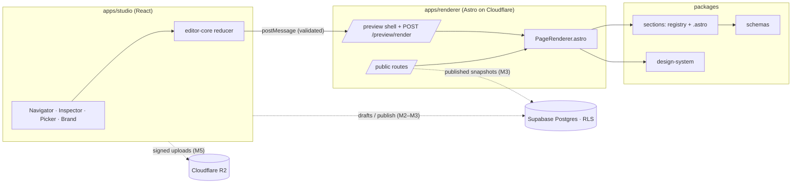
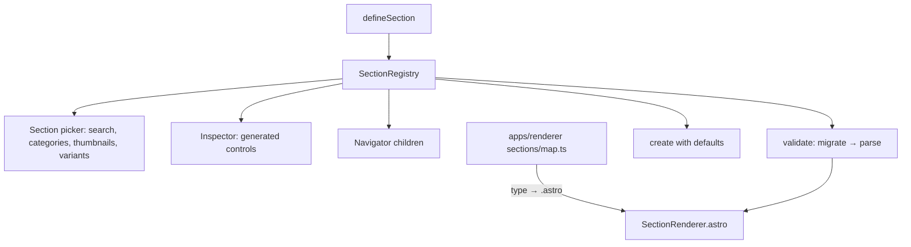
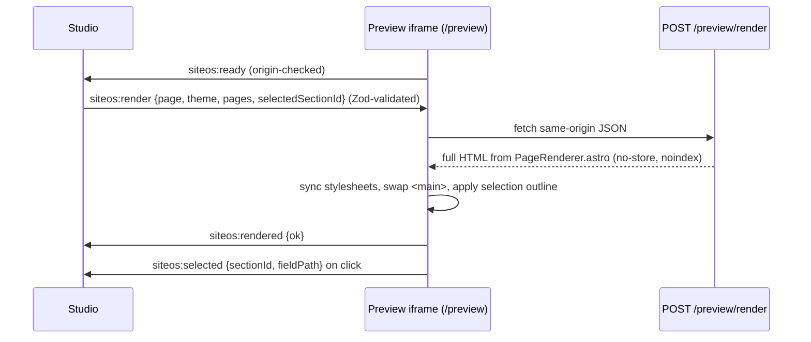
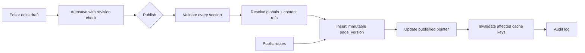
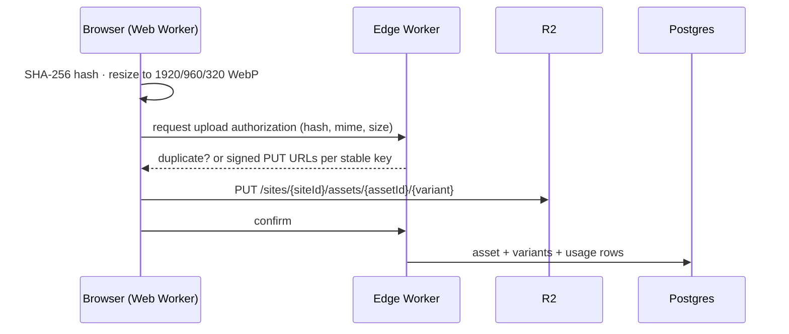

# SiteOS — a Business Website Operating System

A headless CMS and structured visual website builder for small and medium businesses. Owners and
marketing staff compose professional pages from a library of **structured sections**, edit them in a
**live preview** that renders production markup, and publish **immutable versions** to a fast,
lightweight **Astro** site. Users edit business intent (variant, alignment, theme) — never CSS.

```text
BUSINESS CONTENT + DESIGN SYSTEM + SECTION LIBRARY + VISUAL COMPOSITION + ASSETS  ⇒  FAST BUSINESS WEBSITE
```

> **Status:** Milestones 1–7 are complete: architecture foundation, database + auth, publishing, a 24-type section library, the asset system, the content library with global sections, and SEO + forms. See
> [Roadmap](#roadmap) for what exists today versus what is designed but not yet built.

## What works today

- Three-panel Studio (pages / sections / brand · live preview · inspector) with dark mode.
- Section Registry driving the picker, inspector, navigator, validation, defaults, variants and migrations.
- 23 section types with 61 layout variants, all on the registry: Navigation bar, Announcement bar, Hero, Rich text,
  Image + Text, Quote, Statistics, Features (incl. bento), Services, Process, Logo cloud, Testimonials, Gallery, Video,
  Call to action, FAQ, Opening hours, Locations, Menu, Pricing, Team, Portfolio, Footer.
- Asset system: browser-side SHA-256 and Web Worker resizing (1920/960/320 WebP, never upscaled), signed-ticket uploads
  through a Cloudflare Worker into R2, magic-byte type checks, duplicate detection, asset browser with search/filters,
  alt text + decorative flag + focal point + tags, usage graph ("Used in 3 places"), delete protection, `srcset` output.
- Content library: eight predefined collections (testimonials, services, team, locations, FAQs, logos, stats, projects)
  edited once and shown by any list section via `source` (all / by tag / picked). Global sections (edit once, appears on
  every page, detach to localize). Published versions inline both, so they stay self-contained.
- SEO: per-page and site-wide metadata with search/social previews, canonical, Open Graph, Twitter card, favicon,
  JSON-LD from configured facts only, per-site sitemap.xml and robots.txt, 301 redirects.
- Forms: template-based builder, Form section, protected public endpoint on the edge worker (rate limit, honeypot,
  timing, server-side validation), submissions inbox with read state, filters and CSV export. Works without JavaScript.
- Public design system: seven self-hosted variable fonts (SIL OFL), fluid type scale, tinted shadows, one page-load
  reveal, seven opinionated theme presets.
- Constrained rich text (Tiptap in the Studio, a whitelisted ProseMirror JSON subset on disk, HTML generated from the
  tree — never sanitized HTML). Repeatable lists with nested lists, a curated inline-SVG icon set, privacy-enhanced
  video embeds, no-JavaScript mobile menu and FAQ accordion.
- Live preview in an iframe that renders **the same Astro components** as the public site.
- Click a heading in the preview → the section is selected and the field is focused.
- Desktop / tablet / mobile preview at real viewport widths.
- Drag-and-drop reordering (dnd-kit) with keyboard and menu alternatives; duplicate, hide, delete.
- Coalesced undo/redo (⌘Z / ⇧⌘Z), autosave with save-state indicator, ⌘S.
- Design tokens with six theme presets, curated system font stacks, WCAG contrast warnings.
- Typed links (page id, URL, email, phone, anchor); image refs with alt text, decorative flag and focal point.
- Demo site “Kopi Sudut” rendered at `/` and `/about` with semantic HTML, no client JavaScript.
- Supabase Auth sign-in (password or magic link, no public sign-up UI), organizations → sites → pages with
  row-level security, roles (owner/admin/editor/publisher/viewer), site creation with seeded demo pages.
- Drafts persist to Postgres through `save_page_draft`, which rejects stale revisions instead of overwriting;
  the Studio shows “Changed elsewhere” with a reload action.
- Publish creates an immutable `page_versions` row and moves the published pointer; the Publish dialog blocks on
  invalid sections and lists human-readable changes since the live version. Version history with restore.
- Public site and JSON content API (`/s/:site/*`, `/api/content/sites/:site/pages/*`) read published snapshots
  only through anon-callable RPCs, with `s-maxage` caching and ETags (304 on `If-None-Match`).

## Quick start

```bash
pnpm install
cp .env.example .env            # fill in the Supabase URL + publishable key
supabase login && supabase link --project-ref <ref> && supabase db push   # apply migrations
pnpm dev                        # Studio → http://localhost:5180 · Renderer → http://localhost:4321
```

Create the first user in the Supabase dashboard (Authentication → Users → Add user, confirmed). Public
self-registration should be disabled in Authentication → Sign In / Providers.

Other commands:

```bash
pnpm typecheck    # tsc / astro check across the workspace
pnpm lint         # Biome
pnpm test         # Vitest (packages + Studio)
pnpm e2e          # Playwright: starts both dev servers, runs the Milestone 1 flow
pnpm build        # production builds (Studio static assets, Renderer Cloudflare Worker)
pnpm check        # all of the above except e2e
```

## Monorepo

```text
apps/
  studio/          React 19 · Vite · Tailwind 4 · shadcn/ui · TanStack Router & Query · dnd-kit
  renderer/        Astro 7 (server output, Cloudflare adapter) — public site, preview shell, render route
  edge/            Cloudflare Worker + Hono: ticketed R2 uploads, asset serving (forms later)
packages/
  db/              Supabase client factory, generated Database types, typed repository helpers, RLS tests
  schemas/         Zod: page document, section envelope, links, images, theme tokens, preview protocol
  sections/        defineSection · SectionRegistry · migrations · per-section folders with .astro renderers
  design-system/   theme presets · token → CSS variables · base.css · contrast math
  editor-core/     framework-free editor reducer (add/move/duplicate/hide/update, coalesced undo/redo)
  content-sdk/     (M3) typed client for the published-content API
docs/              architecture, section authoring, migrations, design system, publishing, assets, content & globals, SEO & forms, security, deployment, business packs
e2e/               Playwright flows
```

Packages export TypeScript source directly (`exports: "./src/index.ts"`); Vite, Astro and Vitest
consume it, so there is no package build step to keep in sync.

## System architecture



## Section Registry

`defineSection()` is the single source of truth for a section: schema, defaults, variants (with
wireframe thumbnails), inspector groups, migrations, capabilities and performance hints. It fails at
module load if defaults or variants disagree with the schema. The registry drives the picker, the
generated inspector, navigator children, validation and document normalization. Unknown or invalid
sections are **kept and flagged**, never dropped.



Persisted shape: `{ id: "sec_…", type, schemaVersion, hidden, props }`. Variant lives in `props.variant`
and is validated by the section schema, so there is one schema per section.
See [docs/section-authoring.md](docs/section-authoring.md) and [docs/section-migrations.md](docs/section-migrations.md).

## Live preview



Both sides check `event.origin` against a configured origin and validate payloads with the shared
Zod schemas. Nothing is evaluated; Astro escapes output. A reloaded iframe re-announces `ready` and is
re-rendered immediately. Astro's CSRF origin check protects the render route. Details:
[docs/architecture.md](docs/architecture.md).

## Design tokens

Theme tokens (`colors`, `typography`, `shape`, `layout`) compile to stable CSS variables such as
`--color-primary`, `--font-heading`, `--radius-md`, `--container-width`, `--section-spacing`.
Sections consume only these variables plus the `.section.theme-{light|surface|dark|brand}` surfaces.
Switching a preset preserves every word of content. See [docs/design-system.md](docs/design-system.md).

## Publishing lifecycle



## Asset upload



## Database model and authorization

`supabase/migrations/20260921200000_core.sql`: `organizations`, `organization_members`, `sites` (theme JSONB),
`site_members`, `pages`, `page_drafts` (one mutable draft per page with an integer `revision`), `audit_logs`.
Every table carries `site_id` and has RLS enabled; `has_site_role(site_id, min_role)` ranks roles
owner > admin > publisher > editor > viewer. Writes that need invariants go through `security definer` RPCs
(`create_site`, `create_page`, `save_page_draft`, `update_site_theme`, `delete_page`) that re-check the
caller's role. Direct inserts into `sites`, `site_members` (by non-admins) and `page_drafts` are impossible.
Isolation and revision conflicts are covered by `packages/db/test/rls.test.ts`, which runs against the real
project when `SUPABASE_SECRET_KEY` is set. Public content endpoints arrive in Milestone 3.
See [docs/publishing.md](docs/publishing.md) and [docs/security.md](docs/security.md).

## SEO, accessibility, performance

- Per-page and per-site SEO, sitemap, robots, canonical and JSON-LD: see docs/seo-and-forms.md.
- Renderer output is semantic HTML with one `h1` per page, skip link, focus styles, `alt` or
  `decorative` on every image, lazy loading below the fold and `fetchpriority=high` for the first section's media.
- Public pages ship **zero client JavaScript** in Milestone 1; React islands are reserved for genuinely interactive sections.
- The Studio warns on missing alt text and on theme colors that fail WCAG AA contrast. Automated checks do not guarantee compliance.

## Deployment & free-tier notes

Studio → Cloudflare static assets · Renderer → Cloudflare Worker (Astro adapter) · Edge → Workers ·
Assets → R2 · Content → Supabase. Costs stay low by rendering published snapshots, resizing images in
the browser, and avoiding background jobs, polling and paid services. Limits and steps:
[docs/deployment.md](docs/deployment.md).

## Known limitations (Milestone 1)

- Cache invalidation on publish relies on short `s-maxage` (5 min) rather than an explicit purge; a Cloudflare
  purge hook is a hardening item.
- Public site routing is path-based (`/s/<site-slug>/…`) or a single default site via `DEFAULT_SITE_SLUG`;
  platform subdomains are supported when `PUBLIC_PLATFORM_DOMAIN` is set, custom domains are not yet.
- Invitations UI is not built; members are added via SQL/dashboard for now (owners/admins may insert `site_members`).
- R2 is not yet enabled on the target Cloudflare account; the worker is verified against Wrangler's local R2 simulation. SVG uploads are refused until a sanitizer exists.
- Global sections have no separate version history; each page version snapshots the global content it was published with.
- Responsive overrides are declared in the registry (`capabilities.responsive`) but not yet editable.

## Roadmap

| Milestone | Scope | Status |
|-----------|-------|--------|
| 1 Architecture foundation | monorepo, registry, 3 sections, tokens, live preview, editor | **done** |
| 2 Database + auth | Supabase Auth, orgs/sites/memberships, RLS, autosave with revisions | **done** |
| 3 Publishing | immutable versions, publish, rollback, public content API, content SDK | **done** |
| 4 Section library | 23 sections on the registry | **done** |
| 5 Assets | ticketed R2 uploads, Web Worker resize, focal point, usage graph, dedupe | **done** |
| 6 Content + globals | reusable collections, global sections, detach | **done** |
| 7 SEO + forms | metadata, sitemap, JSON-LD, form builder, inbox, public design pass | **done** |
| 8 Business packs | packs, page recipes, presets, guided creation | next |
| 9 Hardening | a11y, performance, caching, mobile editor, health checks | planned |

## Third-party assets

Demo imagery under `apps/renderer/public/demo/` consists of original SVG illustrations created for
this repository (no third-party licenses). The Studio self-hosts the Geist variable font
(`@fontsource-variable/geist`, SIL OFL 1.1). Public sites self-host Inter, Manrope, DM Sans, Space Grotesk, Fraunces,
Playfair Display and Lora (all SIL OFL 1.1, via `@fontsource-variable/*`, copied to `apps/renderer/public/fonts` by
`scripts/sync-fonts.mjs`; see `public/fonts/LICENSES.md`). No fonts or scripts are loaded from third parties.
# busyness-cms
